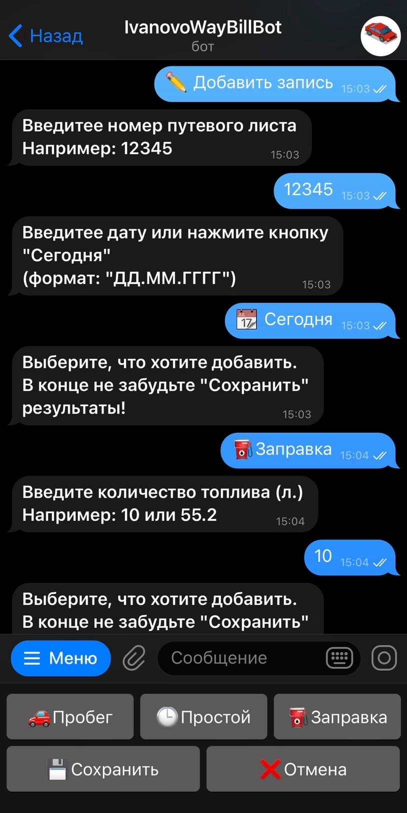
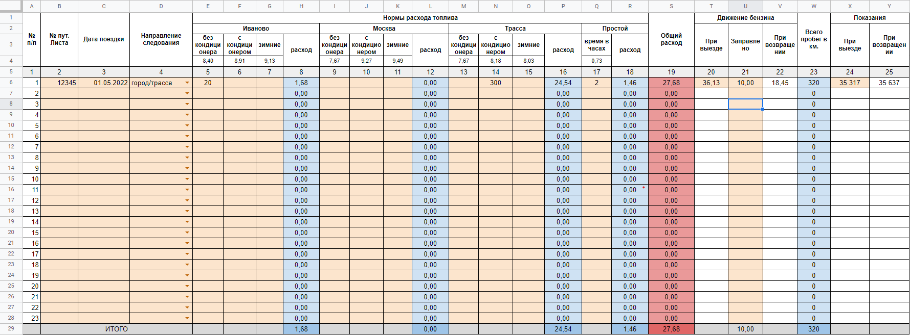

# Way Bill Bot
## _Telegram bot for filling way bill table_

## Description
The Telegram bot for filling information about your ways on car into Google Sheets.

## Instalation
Clone repository on your server.

Then create file **creds.json** and add creadentials for you Google Service Account.
It should look like:
```json
{
  "type": "service_account",
  "project_id": "<your_project_name>",
  "private_key_id": "<private_key_id>",
  "private_key": "<private_key>",
  "client_email": "<service_account_email>",
  "client_id": "<client_id>",
  "auth_uri": "https://accounts.google.com/o/oauth2/auth",
  "token_uri": "https://oauth2.googleapis.com/token",
  "auth_provider_x509_cert_url": "https://www.googleapis.com/oauth2/v1/certs",
  "client_x509_cert_url": "<link>"
}
```

Then go to **/way_bill/config/bot.ini** and fill your settings fields:

- token
- users
- spreadsheet

Build Docker image:
```sh
docker build -t way_bill .
```

And then run container instance:
```sh
docker run -d --restart unless-stopped way_bill
```

## Examples
Bot interface:


Table example:

